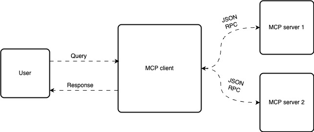

## Introduction
Large language models (LLMs) today are way more than just chat tools. We started out using them for funseeing what they know and how deeply they understand a topic. But now, we're using them as go-to tools for everything from searching the internet to writing code and even just vibing with programming in general.

LLMs have become a part of our everyday lives. They help us get things done faster and make a lot of tasks easier. Initially, their use was limited to whatever capabilities were built into them. But what if we could go beyond that, what if we could make LLMs do things exactly how *we* want them to?

## Function Calling

OpenAI came up with a neat solution to this challenge by introducing a technique called **Function Calling**. So, what exactly is function calling?

Function Calling is a way to connect tools or custom code to a large language model (LLM). When a user asks something, the model can use these tools to take action or fetch the needed information. This has really stepped up how we interact with LLMs. It’s no longer just about chatting, but actually getting things done.

> So how do LLMs know which tool or function to call?

Well, on their own, LLMs can only generate text, they can’t directly trigger actions or run code. That’s where frameworks come in. These frameworks act as a bridge between the LLM and the tools you want to use.

**Here’s how it works**: you provide some metadata about the tools (like the function name, parameters, and description) which is passed as context to the model. Based on this info and the user's query, the LLM generates a special output that *looks* like a function call with the right parameters. The framework then takes that output and actually runs the function.

Not all LLMs can do this, only those that are specifically trained to support function calling. And there are some popular frameworks out there that make this integration easier, like:

1. **LangChain**
2. **LlamaIndex**

These tools are opening up a whole new level of interaction with AI, making it more dynamic and action-oriented. While the function calling is sufficient for simple tasks where the model needs to dynamically decide actions, like a customer service bot checking for order status. We need a new framework for performing complex tasks at a scale.

## Model Context Protocol

**Model Context Protocol (MCP)** is an open protocol designed to make it easy for LLM-based applications to connect with external data sources and tools. It gives a standardized way to supply the right context to language models so they can work more effectively. MCP was developed by **Anthropic** with the goal of simplifying these kinds of integrations and making them scalable.

MCP uses a **client-server architecture**. In this setup, *clients* (like IDEs or any app that can talk to LLMs) connect to *servers* that offer specific capabilities—things like accessing local files or calling external APIs. This structure helps organize communication and manage functionality in a clean, efficient way.



As shown in the block diagram, a client can connect to multiple MCP servers. Each connection follows a **1:1 relationship** and uses **JSON-RPC** for communication. The current version of the protocol supports interaction over **stdio** and **HTTP using Server-Sent Events (SSE)**.

Here’s how the typical workflow goes:
1. The user makes a query.
2. This query, along with the available tools and their context, is passed to the LLM.
3. The LLM decides whether it needs to use any of the tools to generate an answer.
4. If it does, it extracts the required information from the user's input and calls the appropriate tool.
5. Once the tool sends back a response, the LLM formats that data and returns a final, polished response to the user.

### Defining a sample MCP server

Let us start by defining an MCP server with two tools for simplicity. One of the tool fetches the supported kubernetes and openshift versions from ibmcloud. The other one will be a simple addition tool which takes in two integers and returns the added output.

Considering that most of the blogs are focusing on the `STDIO`, let us see how we can work on `SSE`. The below is an example of a server code. 

```python
from mcp.server.fastmcp import FastMCP
import requests

server = FastMCP("my_mcp_server", 9000)

@server.tool()
def fetch_cluster_versions() -> dict:
	"""
	This function fetches the openshift and kubernetes versions supported 	by IBM Cloud
	"""
	headers = {
	"Accept" : "application/json"
	}
	url = "https://containers.cloud.ibm.com/global/v2/getVersions"
	response = requests.get(url, headers= headers)
	return response.json()

@server.tool()
def add(x: int, y: int)-> int:
	"""
	The function performs the additon of the given two integers

	Args:
	x: integer
	y: integer
	"""
	return x + y

server.run("sse")
```

Considering that we are using `SSE`as the transport mechanism, we need to run the server seperately from the client. The above server exposes two endpoints
1. http://localhost:9000/sse for the server side events
2. http://localhost:9000/messages for the messages from client to server

### Defining a custom MCP client with ollama

We will be using langchain to integrate the tools to the client, let us start with ollama

```python
import asyncio

from mcp.client import ClientSession
from mcp.client.sse import sse_client

from langchain_mcp_adapters.tools import load_mcp_tools
from langgraph.prebuilt import create_react_agent
from langchain_core.messages import AIMessage, HumanMessage

from langchain_ollama import ChatOllama

model = ChatOllama(mode="qwen2.5:7b")

async def main():
	async with sse_client("http://localhost:9000/sse") as (read_stream, write_stream):
		async with ClientSession(read_stream, write_stream) as session:
			await session.initialize()
			tools = await.load_mcp_tools(session)
			agent = create_react_agent(model, tools)
			print("\nMCP Client Started")
			print("Type your queries or 'quit' to exit.")
			while True:
				try:
					query = input("\nQuery: ").strip()
					if query.lower() == 'quit':
						break
					query = HumanMessage(content=query)
					response = await agent.ainvoke({"messages": query})
					message = response["messages][-1]
					print(message.content)
				except Exception as e:
					print(f"\n Error: {str(e)}")

if __nama__ == "__main__":
	asyncio.run(main())


```

**Issue with ollama**
1. One of the main challenges with Ollama is that the function-calling LLMs it supports are heavily quantized. While this helps reduce the model size and makes it runnable on local machines, it can lead to inconsistencies—especially when it comes to reliably calling tools or functions.
2. Since Ollama is designed to run on typical consumer hardware, it's limited by the compute power available. As a result, the model's responses can sometimes lack quality or depth compared to those running on more powerful cloud-based setups.

We can easily switch to any LLM, for example, IBM’s Watsonx is shown below by simply updating the model as shown below. The rest of the code remains unchanged. 

```python
from langchain_ibm import ChatWatsonx
from ibm_watsonx_ai.foundation_models.schema import TextChatParameters

parameters = TextChatParameters(
			temperature = 0.4,
			max_tokens = 200
)

model = ChatWatsonx(
		model_id = "<model>"
		url = "<url>"
		apikey = "<apikey>"
		project_id= "<project_id>"
		params = parameters
)
```
 
### Issues with MCP

While MCP offers a lot of advantages, it’s also important to be aware of the challenges that can come with working with it:
1. **Tool Execution Issues** – I ran into problems where MCP tools didn’t behave as expected, especially when trying to invoke shell commands on the server side. These kinds of hiccups can make debugging tricky.
2. **Tool Poisoning Attacks** – These are security threats where malicious actors exploit tool connections to manipulate or steal sensitive data. It’s a serious risk that developers need to be mindful of when building integrations.
3. **Trusting Third-Party Servers** – As the number of MCP servers grows, it becomes harder to determine which ones are trustworthy. Relying on third-party tools always introduces an element of risk.
4. **Risk of Misuse** – The ability to run code through tools is powerful—but if not properly controlled, it could be misused, potentially leading to unintended or even harmful actions.
5. **Early Community Stage** – Since MCP is still relatively new, its developer community is just getting started. That means fewer tutorials, limited documentation, and a smaller pool of shared knowledge to draw from when you run into issues.

### Function Calling vs MCP

#### Differences
1. Function calling is tied to specific LLM provider formats while MCP is provider agnostic
2. Function calling requires pre-defined functions whereas MCP is dynamic and enables a runtime discovery
3. Function calling requires manual updates for new functions while MCP simplifies adding new tools and resources dynamically.

#### Optimial usage
**Function calling**
1. Simple API calls like fetching weather data or stock prices
2. Standalone applications with limited external tool requirements
3. Cases where the function set is well-defined and relatively static

**MCP**
1. Applications requiring interaction with multiple tools
2. Systems needing to maintain context across different function calls
3. Environments requiring real-time updates without constant requests
4. Solutions that must work across multiple LLM providers
## Conclusion

LLMs have evolved from being simple chat tools that could only share pre-trained information to powerful systems capable of taking action based on user needs. The next big step in this journey is adopting **agentic frameworks** built on top of protocols like **MCP**. In this setup, agents can intelligently break down a user’s query into smaller tasks and perform the necessary actions using integrated tools and data sources.

This shift isn’t just about improving what LLMs *can* do, it’s about reshaping how we build AI-powered applications altogether. With agentic designs and standardized protocols like MCP, we’re moving toward a future where AI systems can reason, act, and adapt—bringing us closer to truly intelligent assistants.

## References

- [Model context protocol official documentation](https://modelcontextprotocol.io/introduction)
- [Python SDK for MCP](https://github.com/modelcontextprotocol/python-sdk)
- [Langchain MCP adapters](https://github.com/langchain-ai/langchain-mcp-adapters)

## Explore More

- [MCP Servers](https://github.com/modelcontextprotocol/servers/tree/main)
- [Community build MCP servers](https://mcpservers.org/category/development)